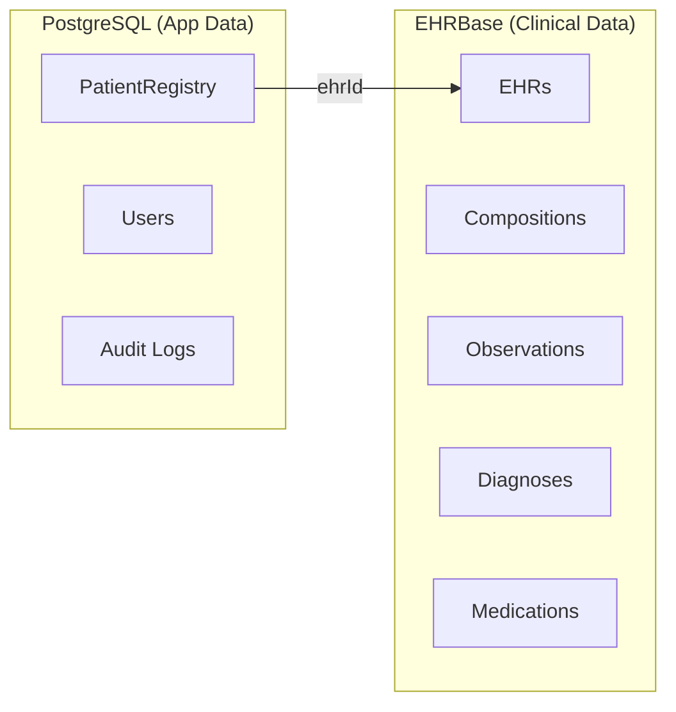

# Data Model

Open CIS uses a **dual-database architecture**: clinical data lives in EHRBase (openEHR), while application data lives in PostgreSQL via Prisma.

## Why Two Databases?

openEHR provides a purpose-built data model for clinical information -- archetypes, compositions, and versioned records with full audit trails. Storing this in a traditional relational database would mean reinventing what EHRBase already provides.

However, not everything is clinical data. User accounts, audit logs, and the mapping between patient identifiers and EHR IDs are application concerns that fit naturally in a relational database.

## What Goes Where



| Data | Storage | Rationale |
|------|---------|-----------|
| Vital signs, blood pressure, pulse | EHRBase | Clinical observations -- archetyped, versioned |
| Diagnoses, problem lists | EHRBase | Clinical data with standard coding |
| Medications | EHRBase | Clinical orders and administrations |
| Encounter records | EHRBase | Clinical compositions |
| Patient demographics (MRN, name, DOB) | PostgreSQL | App-level patient registry |
| MRN-to-EHR ID mapping | PostgreSQL | Links app identity to clinical record |
| User accounts | PostgreSQL | Authentication, not clinical |
| Audit logs | PostgreSQL | Application-level auditing |

## PatientRegistry: The Bridge

The `PatientRegistry` table in PostgreSQL is the bridge between the application world and the clinical world:

```
PatientRegistry
├── id          (UUID, primary key)
├── mrn         (String, unique medical record number)
├── ehrId       (String, EHR ID in EHRBase)
├── givenName   (String)
├── familyName  (String)
├── birthDate   (DateTime)
├── createdAt   (DateTime)
└── updatedAt   (DateTime)
```

When a new patient is created:

1. The API creates a new EHR in EHRBase (`POST /ehr`)
2. EHRBase returns an `ehr_id`
3. The API stores the MRN, demographics, and `ehr_id` in the PatientRegistry
4. All subsequent clinical data is stored in EHRBase under that `ehr_id`

## Querying Clinical Data

Clinical data is queried using **AQL** (Archetype Query Language), not SQL. AQL queries run against EHRBase and understand the archetype structure:

```sql
SELECT
    o/data[at0001]/events[at0006]/data[at0003]/items[at0004]/value/magnitude as systolic,
    o/data[at0001]/events[at0006]/data[at0003]/items[at0005]/value/magnitude as diastolic
FROM EHR e
CONTAINS COMPOSITION c
CONTAINS OBSERVATION o[openEHR-EHR-OBSERVATION.blood_pressure.v1]
WHERE e/ehr_id/value = :ehr_id
ORDER BY c/context/start_time/value DESC
```

See [openEHR Concepts](openehr.md) for more on AQL and the archetype model.
