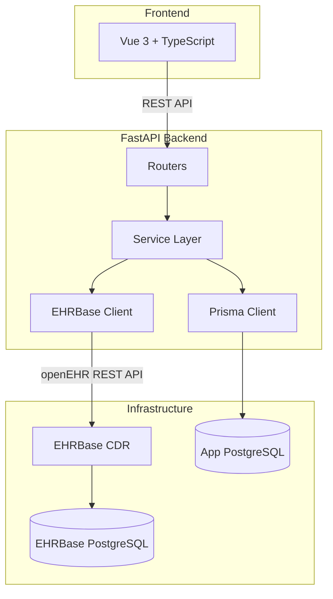

# Architecture Overview

Open CIS follows a layered architecture with a clear separation between clinical data (stored in openEHR) and application data (stored in PostgreSQL).

## System Diagram



## Request Flow

A typical request, such as recording a patient's vital signs, flows through these layers:

1. **Vue frontend** sends a POST request to `/api/patients/{id}/vital-signs`
2. **Router** (`router.py`) validates the HTTP request and delegates to the service layer
3. **Service** (`service.py`) orchestrates the business logic:
    - Looks up the patient's EHR ID from the app database via Prisma
    - Builds an openEHR composition in FLAT format
    - Sends the composition to EHRBase via the HTTP client
4. **EHRBase** validates the composition against the registered template and persists it
5. The composition UID is returned back through the layers to the frontend

## Service Layer Pattern

Each domain module in the API follows a consistent structure:

```
api/src/patients/
├── router.py       # FastAPI route definitions and HTTP handling
├── service.py      # Business logic (orchestrates repository + EHRBase)
├── repository.py   # Prisma database operations
└── schemas.py      # Pydantic models for request/response validation
```

- **Routers** handle HTTP concerns: request parsing, response formatting, status codes
- **Services** contain business logic and orchestrate calls to repositories and EHRBase
- **Repositories** encapsulate Prisma database operations
- **Schemas** define Pydantic models shared between layers

## EHRBase Integration

The `api/src/ehrbase/` module provides the integration layer with EHRBase:

```
api/src/ehrbase/
├── client.py         # Core REST API client (async httpx)
├── compositions.py   # Helpers for creating/parsing compositions
├── templates.py      # Template management utilities
└── queries.py        # AQL query builders and executors
```

All EHRBase communication uses `httpx.AsyncClient` for non-blocking HTTP requests. See [ADR-0004](../decisions/0004-direct-httpx-integration.md) for the rationale behind this approach.

## Key Design Decisions

| Decision | Summary | ADR |
|----------|---------|-----|
| Use openEHR for clinical data | Archetype-based modeling with EHRBase | [ADR-0001](../decisions/0001-use-openehr.md) |
| FastAPI backend | Async Python with type safety | [ADR-0002](../decisions/0002-fastapi-backend.md) |
| Automatic template registration | OPT files uploaded on API startup | [ADR-0003](../decisions/0003-template-management.md) |
| Direct httpx integration | Lightweight client instead of SDK | [ADR-0004](../decisions/0004-direct-httpx-integration.md) |
| Custom seed scripts | Faker-based synthetic data for staging | [ADR-0005](../decisions/0005-synthetic-data.md) |
