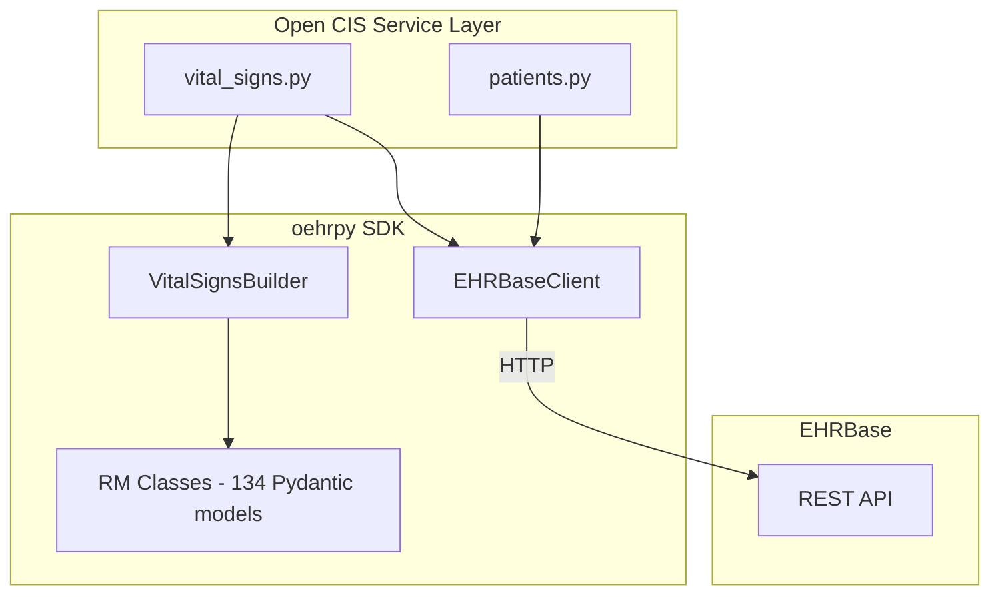

# oehrpy Integration

This page describes how Open CIS integrates oehrpy to replace raw HTTP calls with type-safe SDK usage. See [PRD-0005](https://github.com/platzhersh/open-cis/blob/main/docs/prd/0005-oehrpy-sdk-integration.md) for the full integration plan.

## Before and After

### Before: Manual FLAT Construction

```python
# Fragile: path strings can have typos, no validation
flat_data = {
    "ctx/language": "en",
    "ctx/territory": "US",
    "ctx/composer_name": composer,
    "vital_signs_observations/vital_signs/blood_pressure/systolic|magnitude": systolic,
    "vital_signs_observations/vital_signs/blood_pressure/systolic|unit": "mm[Hg]",
    "vital_signs_observations/vital_signs/blood_pressure/diastolic|magnitude": diastolic,
    "vital_signs_observations/vital_signs/blood_pressure/diastolic|unit": "mm[Hg]",
    # ... more paths prone to typos
}

# Raw HTTP call
async with httpx.AsyncClient() as client:
    response = await client.post(
        f"{EHRBASE_URL}/ehr/{ehr_id}/composition",
        json=flat_data,
        headers={"Content-Type": "application/openehr.flat+json"},
    )
```

### After: oehrpy VitalSignsBuilder

```python
from openehr_sdk.templates import VitalSignsBuilder
from openehr_sdk.client import EHRBaseClient

# Type-safe builder with IDE autocomplete
builder = VitalSignsBuilder(
    composer_name=composer,
    start_time=recorded_at,
)
builder.add_blood_pressure(systolic=systolic, diastolic=diastolic)
builder.add_pulse(rate=pulse)

# Validated FLAT output
flat_data = builder.build()

# Async client handles auth, headers, errors
async with EHRBaseClient(...) as client:
    uid = await client.create_composition(
        ehr_id=ehr_id,
        template_id=VitalSignsBuilder.template_id,
        composition=flat_data,
        format="flat",
    )
```

## Architecture



## What oehrpy Replaces

| Component | Before (raw httpx) | After (oehrpy) |
|-----------|---------------------|-----------------|
| EHR operations | Manual HTTP calls in `ehrbase/client.py` | `EHRBaseClient.create_ehr()`, `.get_ehr()` |
| Composition creation | Manual FLAT dict construction | `VitalSignsBuilder` with type-safe API |
| AQL queries | Raw query strings via HTTP POST | `EHRBaseClient.execute_aql()` |
| Template management | Manual HTTP calls | `EHRBaseClient.list_templates()`, `.upload_template()` |
| Validation | None until EHRBase HTTP 422 | Pydantic validation at build time |

## Dependency Injection

oehrpy integrates with FastAPI's dependency injection:

```python
from openehr_sdk.client import EHRBaseClient
from fastapi import Depends

async def get_ehrbase_client():
    async with EHRBaseClient(
        base_url=settings.ehrbase_url,
        username=settings.ehrbase_user,
        password=settings.ehrbase_password,
    ) as client:
        yield client

@router.post("/vital-signs")
async def create_vital_signs(
    data: VitalSignsCreate,
    client: EHRBaseClient = Depends(get_ehrbase_client),
):
    ...
```

## Benefits

- **Type safety** -- no more path string typos, full IDE autocomplete
- **Validation** -- catch errors before sending to EHRBase
- **Less code** -- ~150 lines of integration code reduced to ~50
- **Testability** -- mock `EHRBaseClient` in tests instead of HTTP responses
- **Consistency** -- single client handles auth, headers, error handling
